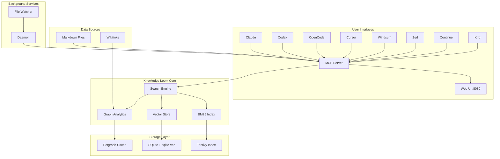
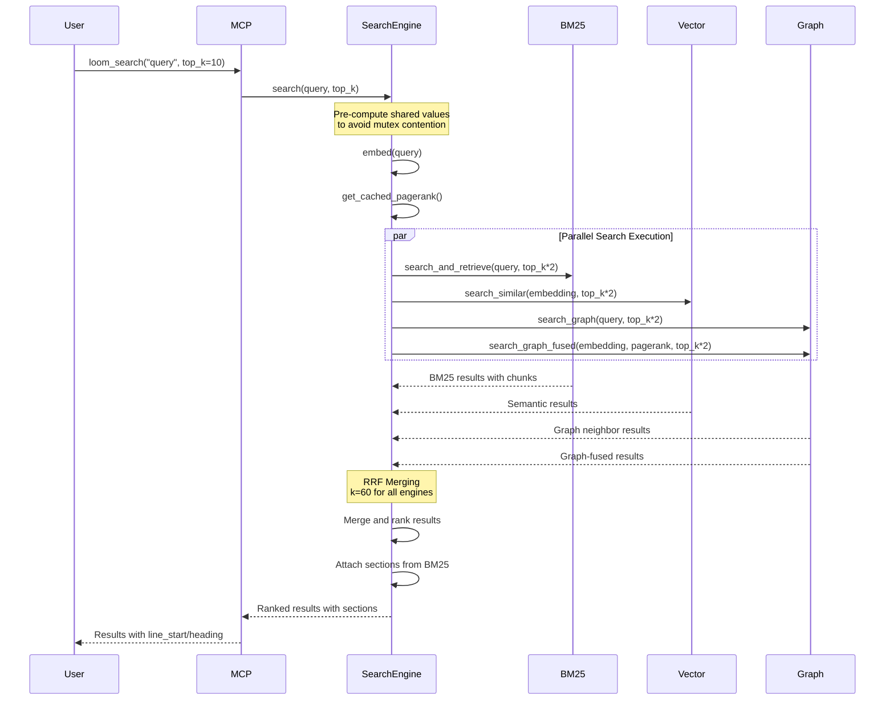

# Architecture

This document provides a deep dive into the Knowledge Loom architecture, components, and internal workings.

## High-Level System Architecture



## Search Flow (RRF Merging)



## Data Processing Pipeline

```mermaid
graph LR
    A[Markdown Files] --> B[Vault Scanner]
    B --> C[Chunk Parser]
    
    C --> D[BM25 Indexer]
    C --> E[Embedding Provider]
    C --> F[Wikilink Extractor]
    
    D --> G[Tantivy Store]
    E --> H[Vector Store]
    F --> I[Graph Builder]
    
    I --> J[PageRank Calculator]
    I --> K[Community Detector]
    
    G --> L[Unified Search]
    H --> L
    J --> L
    K --> L
    
     L --> M[RRF Merged Results]
 ```

 ## Ordinal Metadata Flow

 ```mermaid
 graph LR
     A[Markdown File] --> B[chunks.rs::parse_chunks]
     B --> C[Assign Ordinals]
     C --> D[BM25::index_file]
     D --> E[Tantivy Index]
     E --> F[chunk_ordinal Field]
     
     G[Edit Operation] --> H[Edits::edit_file]
     H --> I[File Content Updated]
     I --> J[BM25::reindex_file]
     J --> K[Delete Old Chunks]
     K --> L[Parse New Chunks]
     L --> M[Assign New Ordinals]
     M --> N[Update Index]
     
     O[Retrieval Request] --> P[BM25::get_chunk_by_ordinal]
     P --> Q[Query by File + Ordinal]
     Q --> R[Return ChunkDoc]
     R --> S[chunk_ordinal Included]
 ```

 **Ordinal Assignment Rules:**
 - Ordinals start at 1 and increment sequentially
 - Ordinals are unique within a file
 - No gaps in ordinal sequence
 - Ordinals reset per file (not global)

 **Re-indexing Behavior:**
 - Edit with same chunk count: Ordinals preserved
 - Edit with chunk split: Ordinals reassigned (1, 2, 3a, 3b, 4, ...)
 - Edit with chunk merge: Ordinals reassigned (1, 2, 3, ..., N-1)
 - Full re-index: Ordinals recalculated from scratch

 ## Re-indexing Flow

 ```mermaid
 sequenceDiagram
     participant User
     participant Edits
     participant BM25
     participant Tantivy
     participant Vault
     
     User->>Edits: edit_file(path, content)
     Edits->>Edits: Apply edit to file
     Edits->>BM25: reindex_file(path, content)
     
     BM25->>Tantivy: Delete old chunks for path
     BM25->>BM25: Parse chunks with ordinals
     BM25->>Tantivy: Add new chunks with ordinals
     BM25->>Tantivy: Commit changes
     
     alt Success
         BM25-->>Edits: Ok(())
         Edits-->>User: Edit successful
     else Failure
         BM25->>BM25: Log failure details
         BM25->>Vault: index_vault()
         BM25->>BM25: set_ingesting(true)
         BM25->>Tantivy: Rebuild entire corpus
         BM25->>BM25: set_ingesting(false)
         BM25-->>Edits: Err("Corpus re-ingestion triggered")
         Edits-->>User: Error with retry guidance
     end
     
     Note over User,Tantivy: During ingestion, requests return<br/>"indexing: try again in 2 seconds"
 ```

 **Re-indexing Triggers:**
 - `edit_file()` operation completes
 - `edit_section()` operation completes
 - `edit_lines()` operation completes

 **Failure Handling:**
 - On re-indexing failure: Drop indices and re-ingest entire corpus
 - Corpus re-ingestion: <3 seconds for typical vaults (10k documents)
 - During ingestion: Return "indexing: try again in 2 seconds" error

 **Concurrent Edit Handling:**
 - Edits to the same file are serialized
 - Edit requests are queued during active re-indexing
 - Queued requests are processed sequentially after re-indexing completes

 ## Component Interaction

```mermaid
graph TB
    subgraph "MCP Server Layer"
        A[LoomServer] --> B[Tool Handler]
        B --> C[Search Engine]
        B --> D[Edit Manager]
        B --> E[Maintenance Manager]
    end
    
    subgraph "Search Engine Components"
        C --> F[BM25 Index]
        C --> G[Vector Index]
        C --> H[Graph State]
        C --> I[Embed Provider]
    end
    
    subgraph "Storage Backends"
        F --> J[Tantivy Index]
        G --> K[SQLite + sqlite-vec]
        H --> L[Binary Graph Cache]
    end
    
    subgraph "Edit Operations"
        D --> M[Vault State]
        D --> N[File Operations]
    end
    
    subgraph "Maintenance"
        E --> O[Index Health]
        E --> P[Reindexing]
    end
```

## Component Breakdown

 ### Vault Scanner (`vault.rs`)

 The vault scanner is responsible for discovering and reading Markdown files from the knowledge base.

 **Key Responsibilities:**
 - File discovery with `.loomignore` support
 - Markdown file filtering
 - Content reading with error handling
 - Path resolution and normalization

 **Implementation Details:**
 - Uses `walkdir` for efficient directory traversal
 - Applies ignore patterns similar to `.gitignore`
 - Handles file system errors gracefully
 - Provides relative paths from KB_ROOT

 ### Chunks Module (`chunks.rs`)

 The chunks module provides UTF-8-safe chunking operations with ordinal metadata for precise chunk retrieval.

 **Key Responsibilities:**
 - Character boundary-safe chunk truncation
 - Ordinal assignment for sequential chunk numbering
 - Heading context extraction (breadcrumb paths)
 - Line number tracking for surgical editing

 **UTF-8 Safety:**
```rust
pub fn truncate_at_whitespace(content: &str, max: usize) -> &str {
    if content.len() <= max {
        return content;
    }
    
    // Find safe character boundary using char_indices()
    let safe_max = content.char_indices()
        .map(|(i, _)| i)
        .take_while(|&i| i <= max)
        .last()
        .unwrap_or(content.len());
    
    let slice = &content[..safe_max];
    match slice.rfind(|c: char| c.is_whitespace()) {
        Some(pos) if pos > 0 => content[..pos].trim_end(),
        _ => slice,
    }
}
```

 **Ordinal Metadata:**
 - Each chunk gets a sequential ordinal number (1-based)
 - Ordinals are unique within a file
 - Ordinals are preserved across re-indexing when chunk count doesn't change
 - Ordinals are reassigned when chunks are split or merged

 **Chunk Structure:**
```rust
pub struct Chunk {
    pub ordinal: u64,           // Sequential position (1-based)
    pub heading: Option<String>, // Breadcrumb path (e.g., "Main > Sub")
    pub content: String,        // Markdown content (max 2000 chars)
    pub line_start: usize,      // Starting line number
    pub line_end: usize,        // Ending line number
}
```

 **Performance:**
 - Chunk truncation: <10ms per chunk (measured: ~9.5 µs)
 - Parse chunks: <10ms per file (measured: ~12.1 µs)
 - Memory overhead: <1% (8 bytes per chunk for ordinal)

 ### BM25 Index (`bm25.rs`)

The BM25 index provides fast full-text search using Tantivy.

**Key Responsibilities:**
- Tantivy-based full-text search
- Chunking strategy (2000 char max)
- Heading-aware chunk boundaries
- Relevance ranking with BM25 algorithm

**Chunking Strategy:**
```rust
pub const MAX_CHUNK_CHARS: usize = 2000;

pub fn truncate_at_whitespace(content: &str, max: usize) -> &str {
    if content.len() <= max {
        return content;
    }
    let slice = &content[..max];
    match slice.rfind(|c: char| c.is_whitespace()) {
        Some(pos) if pos > 0 => content[..pos].trim_end(),
        _ => &content[..max],
    }
}
```

**Heading-Aware Chunking:**
- Chunks respect heading boundaries
- Each chunk tracks its heading context
- Line numbers preserved for surgical editing
- Chunks stored with metadata for precise retrieval

### Vector Store (`index.rs`)

The vector store provides semantic similarity search using sqlite-vec.

**Key Responsibilities:**
- sqlite-vec for semantic similarity
- Heading-based chunking
- Cosine distance search
- Embedding upsert and removal

**Storage Schema:**
```sql
CREATE TABLE IF NOT EXISTS embeddings (
    id INTEGER PRIMARY KEY,
    path TEXT NOT NULL,
    heading TEXT,
    content TEXT NOT NULL,
    embedding BLOB NOT NULL,
    UNIQUE(path, heading)
);
```

**Search Algorithm:**
- Uses cosine distance via sqlite-vec
- Returns top-k most similar chunks
- Distance converted to similarity: `similarity = 1.0 - distance`

### Graph Engine (`graph.rs`)

The graph engine provides wikilink analysis and graph algorithms.

**Key Responsibilities:**
- Petgraph for wikilink analysis
- Wikilink extraction with regex
- Basename resolution for wikilink links
- PageRank computation (damping=0.85, 100 iterations)
- Community detection (connected components)
- Path finding (BFS-based)

**Wikilink Extraction:**
```rust
fn extract_wikilinks(&self, content: &str) -> HashSet<String> {
    let re = regex::Regex::new(r"\[\[([^\]|]+)(?:\|[^\]]+)?\]\]")
        .expect("hardcoded wikilink regex is valid");
    
    re.captures_iter(content)
        .filter_map(|cap| cap.get(1))
        .map(|m| m.as_str().trim().to_string())
        .collect()
}
```

**Basename Resolution:**
- Supports Obsidian-style `[[note]]` links
- Resolves to `subdir/note.md` if unique
- Last-write wins on duplicate basenames
- TODO: Prefer closest-path on duplicate basenames

**PageRank Algorithm:**
```rust
pub async fn pagerank(&self, damping: f64, max_iter: usize) -> HashMap<String, f64> {
    // Initialize all nodes with score 1.0
    let mut scores: HashMap<String, f64> = node_map_lock.keys()
        .map(|name| (name.clone(), 1.0))
        .collect();
    
    // Iterate for max_iter iterations
    for _ in 0..max_iter {
        let mut new_scores: HashMap<String, f64> = /* ... */;
        
        // Distribute scores based on out-degree
        for (name, &node_idx) in node_map_lock.iter() {
            let out_edges: Vec<_> = graph_lock.edges(node_idx).collect();
            let out_degree = out_edges.len() as f64;
            
            if out_degree == 0.0 {
                // Dangling node: distribute proportionally
                let share = scores[name] * damping / node_count as f64;
                for other_name in node_map_lock.keys() {
                    *new_scores.get_mut(other_name).unwrap() += share;
                }
            } else {
                let share = scores[name] * damping / out_degree;
                for edge in out_edges {
                    if let Some(target_name) = graph_lock.node_weight(edge.target()) {
                        *new_scores.get_mut(target_name).unwrap() += share;
                    }
                }
            }
        }
        
        // Add teleportation: (1 - damping) / N
        let teleport = (1.0 - damping) / node_count as f64;
        for score in new_scores.values_mut() {
            *score += teleport;
        }
        
        scores = new_scores;
    }
    
    scores
}
```

### Search Engine (`search.rs`)

The search engine unifies all search backends using RRF merging.

**Key Responsibilities:**
- RRF merging of all search backends
- Parallel execution via tokio::join!
- Mutex optimization with pre-computation
- Result ranking and section attachment
- Graph-fused search with PageRank boosting

**RRF Merging Algorithm:**
```rust
// RRF score calculation with k=60
let rrf = 1.0 / (60.0 + rank as f32 + 1.0);

// Applied to each search engine:
// - BM25: file-level using first occurrence
// - Semantic: file-level using first occurrence  
// - Graph: direct neighbor results
// - Graph-fused: PageRank-boosted semantic results
```

**Parallel Execution:**
```rust
// Pre-compute shared values to avoid mutex contention
let query_vec = {
    let embed = self.embed.lock().await;
    embed.embed(query).await
};
let cached_pagerank = {
    self.graph.lock().await.get_cached_analytics().await.0
};

// Run all searches in parallel
let (bm25_results, semantic_results, graph_results, fused_results) = tokio::join!(
    async { /* BM25 search */ },
    async { /* Vector search */ },
    async { /* Graph search */ },
    async { /* Graph-fused search */ }
);
```

**Graph-Fused Search:**
```rust
const PAGERANK_WEIGHT: f32 = 0.5;

pub async fn search_graph_fused_inner(
    &self,
    query_vec: &[f32],
    pagerank: &HashMap<String, f64>,
    top_k: usize,
) -> Result<Vec<String>, String> {
    // Vector similarity search
    let similar = vector.search_similar(query_vec, top_k * 2)?;
    
    // Re-rank: similarity * (1 + PAGERANK_WEIGHT * pagerank)
    let mut by_path: HashMap<String, f32> = HashMap::new();
    for (path, _heading, _content, similarity) in similar {
        let pr_key = path.strip_suffix(".md").unwrap_or(&path);
        let pr_boost = pagerank.get(pr_key).copied().unwrap_or(0.0) as f32;
        let score = similarity * (1.0 + Self::PAGERANK_WEIGHT * pr_boost);
        by_path.entry(path).or_insert(0.0);
        if score > *entry {
            *entry = score;
        }
    }
    
    // Sort and return top-k
    let mut ranked: Vec<(String, f32)> = by_path.into_iter().collect();
    ranked.sort_by(|a, b| b.1.partial_cmp(&a.1).unwrap());
    ranked.truncate(top_k);
    
    Ok(ranked.into_iter().map(|(path, _)| path).collect())
}
```

 ### Edit Manager (`edits.rs`)

 The edit manager provides surgical file operations.

 **Key Responsibilities:**
 - Surgical file operations
 - Heading-based navigation
 - Line-level precision
 - Vault-level management
 - Error propagation from re-indexing operations

 **Key Operations:**
 - `replace_lines` - In-place line replacement
 - `insert_after_heading` - Insert content under a heading
 - `append_to_file` - Append with blank-line separator
 - `create_note` - Create new note with title
 - `edit_note` - Replace full note content
 - `link_notes` - Add wikilink between notes
 - `move_note` - Move note to new location
 - `delete_note` - Delete note from vault

 **Error Handling:**
 - All edit operations return `Result` for error propagation
 - `reindex_file()` collects errors from all three indexes (BM25, vector, graph)
 - Errors are propagated to callers with descriptive messages
 - Atomic semantics: all indexes must succeed or operation fails
 - Partial failures are detected and reported to callers

 ### Maintenance Manager (`maintenance.rs`)

 The maintenance manager handles index health and reindexing.

 **Key Responsibilities:**
 - Index health monitoring
 - Incremental reindexing
 - Cache management
 - Ingestion state management

 **Health Monitoring:**
 - Checks index integrity
 - Monitors chunk counts
 - Tracks last update times
 - Reports storage usage

 **Incremental Reindexing:**
 - Only re-indexes changed files
 - Preserves existing valid indexes
 - Updates graph connections incrementally
 - Maintains cache consistency

 **Ingestion State Management:**
 - Tracks ingestion state to prevent stale reads during rebuild
 - Sets ingestion state before acquiring lock for rebuild
 - Returns "indexing: try again in 2 seconds" error during ingestion
 - Clears ingestion state on success or failure
 - Prevents race conditions between re-indexing and chunk retrieval

## Storage Architecture

### Directory Structure

```
.knowledge-loom/
├── bin/
│   └── loom              # Installed binary
└── loom-shell.sh         # Convenience script

.knowledge-loom-index/
├── bm25/                 # Tantivy index
├── embeddings.db         # SQLite + sqlite-vec
└── graph.bin             # Serialized petgraph
```

### Index Formats

**BM25 Index (Tantivy):**
- Inverted index for fast term lookup
- Stored fields: path, heading, content, line_start, line_end
- BM25 scoring with term frequency and document frequency
- Supports phrase queries and boolean operators

**Vector Store (SQLite + sqlite-vec):**
- Table: embeddings (id, path, heading, content, embedding)
- BLOB field for f32 embedding vectors
- Indexed on path for fast lookup
- sqlite-vec extension for cosine distance

**Graph Cache (Binary):**
- Serialized petgraph DiGraph
- Nodes: note names (without .md extension)
- Edges: wikilink connections with labels
- Bincode serialization for fast load/save

## Performance Characteristics

### Search Latency

| Operation | Latency (10k docs) | Scaling |
|-----------|-------------------|---------|
| BM25 search | ~10ms | Linear |
| Vector search | ~50ms | Linear |
| Graph search | ~100ms (cached) | O(V+E) |
| Graph-fused search | ~60ms | Linear |
| Unified search | ~150ms | Parallel |

### Indexing Performance

| Operation | Speed | Notes |
|-----------|-------|-------|
| Initial build | ~1000 docs/sec | Chunking overhead |
| Incremental update | ~50 docs/sec | Changed files only |
| Graph build | ~2s (10k nodes) | One-time cost |
| PageRank computation | ~500ms (10k nodes) | Cached after first run |

### Memory Usage

| Component | Memory (10k docs) | Scaling |
|-----------|------------------|---------|
| BM25 index | ~50MB | Linear |
| Vector store | ~100MB | Linear |
| Graph cache | ~30MB | Linear |
| Runtime overhead | ~20MB | Constant |
| **Total** | **~200MB** | **Linear** |

### Disk Usage

| Component | Disk (10k docs) | Scaling |
|-----------|----------------|---------|
| BM25 index | ~150MB | Linear |
| Vector store | ~300MB | Linear |
| Graph cache | ~50MB | Linear |
| **Total** | **~500MB** | **Linear** |

## Concurrency Model

### Mutex Strategy

The system uses Arc<Mutex<T>> for shared state with careful optimization:

```rust
// Pre-compute shared values to avoid mutex contention
let query_vec = {
    let embed = self.embed.lock().await;
    embed.embed(query).await
};
let cached_pagerank = {
    self.graph.lock().await.get_cached_analytics().await.0
};

// Now all searches can run in parallel without contention
let (bm25_results, semantic_results, graph_results, fused_results) = tokio::join!(
    /* ... */
);
```

### Parallel Execution

All search engines run concurrently using tokio::join!:

- BM25 search runs independently
- Vector search runs independently
- Graph search runs independently
- Graph-fused search runs independently
- Results merged after all complete

### Cache Invalidation

- PageRank cache invalidated on graph updates
- Community cache invalidated on graph updates
- BM25 index updated incrementally
- Vector store updated incrementally
- Graph updated incrementally

## Platform Integration

### MCP Protocol

Knowledge Loom implements the Model Context Protocol for seamless integration with coding agents.

**Server Capabilities:**
- 30+ tools across search, graph, edit, and maintenance
- Stdio transport for agent communication
- Tool descriptions with JSON schemas
- Error handling and validation

**Tool Categories:**
- Search: 3 tools (unified, file-specific, graph)
- Graph: 4 tools (ranking, connections, paths, themes)
- Navigation: 3 tools (list, outline, grep)
- Read: 2 tools (section, lines)
- Edit: 9 tools (replace, insert, append, create, edit, link, move, delete, preview)
- Maintenance: 2 tools (reindex, status)

### Platform-Specific Configuration

Each platform has unique configuration requirements:

**Claude:** `.mcp.json` with `mcpServers` object
**Codex:** `.codex/config.toml` with TOML format
**Cursor:** `.cursor/mcp.json` with `.cursorrules` instructions
**Windsurf:** `~/.codeium/windsurf/mcp_config.json` with `.windsurfrules`
**Zed:** Platform-specific settings with `context_servers` object
**Continue:** `~/.continue/config.json` with array format
**OpenCode:** `opencode.json` with `mcp` object and `AGENTS.md`
**Kiro:** `.kiro/settings/mcp.json` with `AGENTS.md`

## Extension Points

### Custom Embedding Providers

The system supports pluggable embedding providers with automatic fallback:

```rust
pub trait EmbedProvider: Send + Sync {
    fn embed(&self, text: &str) -> Vec<f32>;
    fn dimension(&self) -> usize;
}
```

**Built-in providers:**
- **LocalEmbedProvider**: Built-in embeddings using fastembed (all-MiniLM-L6-v2, 384 dimensions)
- **OllamaEmbedProvider**: Ollama integration (nomic-embed-text-v1.5, 768 dimensions)
- **OpenRouterEmbedProvider**: OpenRouter integration (openai/text-embedding-ada-002, 1536 dimensions)

**Provider Architecture:**
- **EmbedProviderEnum**: Enum-based provider selection with automatic fallback
- **Priority Chain**: OpenRouter > Ollama > Local
- **Environment Configuration**: Provider selection via environment variables
- **Fallback Logic**: Automatic fallback on provider failure with warning logging
- **Performance Targets**: <100ms local, <500ms Ollama, <1s OpenRouter

**Provider Selection Logic:**
1. Check `OPENROUTER_API_KEY` → Use OpenRouter if available
2. Check `OLLAMA_URL` → Use Ollama if available
3. Default → Use Local provider

**Error Handling:**
- Network errors trigger automatic fallback
- Dimension mismatches are rejected with warnings
- Timeouts are handled gracefully
- All errors are logged for debugging

### Custom Search Engines

The search engine can be extended with additional backends:

1. Implement search function returning `Vec<(String, f32)>`
2. Add to parallel execution in `SearchEngine::search()`
3. Include in RRF merging with appropriate k value
4. Update tool definitions if exposing via MCP

### Custom Graph Algorithms

The graph engine supports custom algorithms:

1. Access graph via `GraphState`
2. Implement algorithm using petgraph API
3. Cache results if expensive
4. Expose via MCP tool if needed

## Security Considerations

### Local-Only Operation

- No network calls by default
- All data stays on local machine
- No cloud dependencies
- No telemetry or analytics

### File System Access

- Respects `.loomignore` patterns
- Only processes Markdown files
- Handles file system errors gracefully
- No arbitrary file execution

### Input Validation

- All MCP inputs validated
- File paths sanitized
- Query length limits enforced
- SQL injection prevented via parameterized queries

## Future Enhancements

### Planned Features

- [ ] LLM-decomposed smart search
- [ ] Advanced community detection (Louvain algorithm)
- [ ] Graph visualization export
- [ ] Real-time indexing with file watching
- [ ] Multi-vault support
- [ ] Advanced query syntax
- [ ] Result caching and memoization
- [ ] Performance profiling tools

### Performance Optimizations

- [ ] Streaming search results
- [ ] Lazy loading of large indexes
- [ ] Query optimization and caching
- [ ] Parallel chunk processing
- [ ] Memory-mapped file access

### Integration Enhancements

- [ ] Additional platform support
- [ ] Webhook notifications
- [ ] REST API for external access
- [ ] Plugin system for extensions
- [ ] Custom tool definitions
