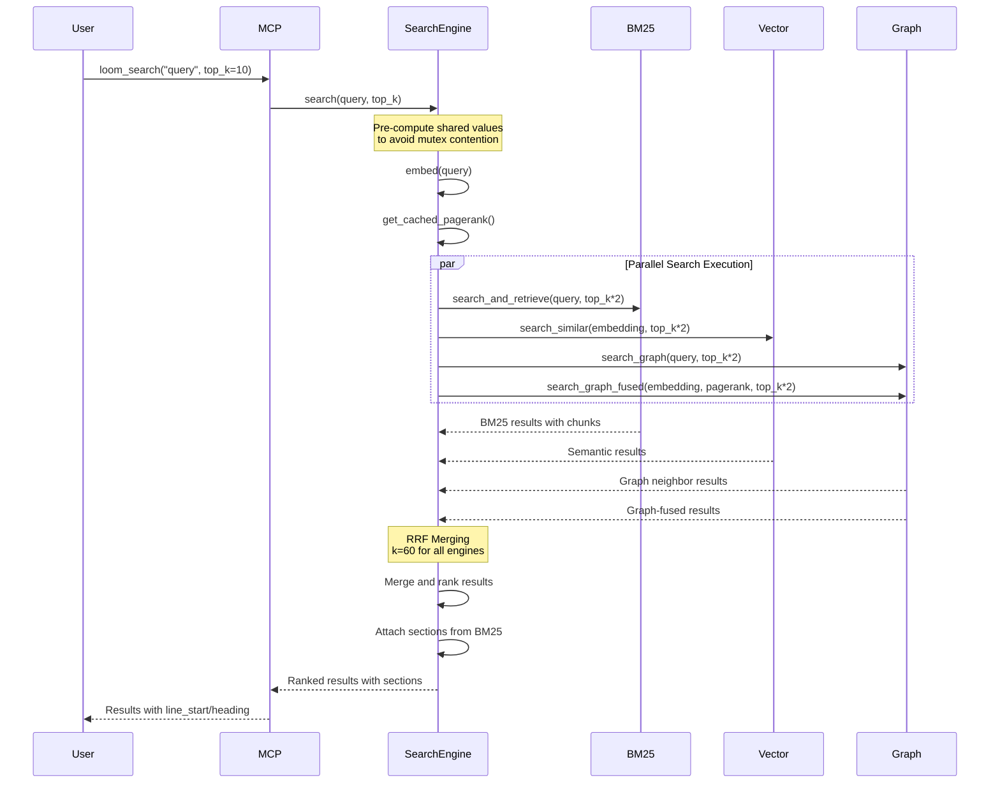

# Architecture

This document provides a deep dive into the Knowledge Loom architecture, components, and internal workings.

## High-Level System Architecture


## Search Flow (RRF Merging)



## Data Processing Pipeline

```mermaid
graph LR
    A[Markdown Files] --> B[Vault Scanner]
    B --> C[Chunk Parser]
    
    C --> D[BM25 Indexer]
    C --> E[Embedding Provider]
    C --> F[Wikilink Extractor]
    
    D --> G[Tantivy Store]
    E --> H[Vector Store]
    F --> I[Graph Builder]
    
    I --> J[PageRank Calculator]
    I --> K[Community Detector]
    
    G --> L[Unified Search]
    H --> L
    J --> L
    K --> L
    
     L --> M[RRF Merged Results]
 ```

 ## Ordinal Metadata Flow

 ```mermaid
 graph LR
     A[Markdown File] --> B[chunks.rs::parse_chunks]
     B --> C[Assign Ordinals]
     C --> D[BM25::index_file]
     D --> E[Tantivy Index]
     E --> F[chunk_ordinal Field]
     
     G[Edit Operation] --> H[Edits::edit_file]
     H --> I[File Content Updated]
     I --> J[BM25::reindex_file]
     J --> K[Delete Old Chunks]
     K --> L[Parse New Chunks]
     L --> M[Assign New Ordinals]
     M --> N[Update Index]
     
     O[Retrieval Request] --> P[BM25::get_chunk_by_ordinal]
     P --> Q[Query by File + Ordinal]
     Q --> R[Return ChunkDoc]
     R --> S[chunk_ordinal Included]
 ```

 **Ordinal Assignment Rules:**
 - Ordinals start at 1 and increment sequentially
 - Ordinals are unique within a file
 - No gaps in ordinal sequence
 - Ordinals reset per file (not global)

 **Re-indexing Behavior:**
 - Edit with same chunk count: Ordinals preserved
 - Edit with chunk split: Ordinals reassigned (1, 2, 3a, 3b, 4, ...)
 - Edit with chunk merge: Ordinals reassigned (1, 2, 3, ..., N-1)
 - Full re-index: Ordinals recalculated from scratch

 ## Re-indexing Flow

 ```mermaid
 sequenceDiagram
     participant User
     participant Edits
     participant BM25
     participant Tantivy
     participant Vault
     
     User->>Edits: edit_file(path, content)
     Edits->>Edits: Apply edit to file
     Edits->>BM25: reindex_file(path, content)
     
     BM25->>Tantivy: Delete old chunks for path
     BM25->>BM25: Parse chunks with ordinals
     BM25->>Tantivy: Add new chunks with ordinals
     BM25->>Tantivy: Commit changes
     
     alt Success
         BM25-->>Edits: Ok(())
         Edits-->>User: Edit successful
     else Failure
         BM25->>BM25: Log failure details
         BM25->>Vault: index_vault()
         BM25->>BM25: set_ingesting(true)
         BM25->>Tantivy: Rebuild entire corpus
         BM25->>BM25: set_ingesting(false)
         BM25-->>Edits: Err("Corpus re-ingestion triggered")
         Edits-->>User: Error with retry guidance
     end
     
      Note over User,Tantivy: During ingestion, requests return<br/>"indexing in progress" error
 ```

 **Re-indexing Triggers:**
 - `edit_file()` operation completes
 - `edit_section()` operation completes
 - `edit_lines()` operation completes

  **Failure Handling:**
  - On re-indexing failure: Drop indices and re-ingest entire corpus
  - Corpus re-ingestion: ~200s for 65 files (3030 chunks); dominated by ONNX CPU inference
  - During ingestion: BM25 sets `is_ingesting` flag; requests return "indexing in progress" error

 **Concurrent Edit Handling:**
  - Edits to the same file are serialized
  - Edit requests are queued during active re-indexing
   - Queued requests are processed sequentially after re-indexing completes

### ReindexState (Incremental Reindex)

The `ReindexState` struct in `src/maintenance.rs` tracks per-file mtime and chunk counts
across reindex runs, enabling incremental reindex on subsequent `loom reindex` invocations.
State is persisted at `.knowledge-loom-index/reindex-state.json`.

```json
{
  "schema_version": 1,
  "files": {
    "path/to/file.md": {
      "mtime_secs": 1716000000,
      "chunk_count": 3
    }
  }
}
```

**Incremental flow**:
1. On first run or `--force`: Full rebuild, save state file
2. On subsequent runs: Compare disk mtimes against state; only reindex changed/deleted files
3. Fallback: If incremental fails (lock timeout, state corruption), full rebuild runs automatically

**Performance**:
- Full first reindex: BM25 ~1s, Vector ~8min (CPU-bound ONNX inference), Graph ~1s
- Incremental: <5s for 1-2 changed files (no vector inference on unchanged files)

### Chunk Splitting

Large sections (exceeding `MAX_CHUNK_CHARS = 800`) are split into multiple chunks at
whitespace boundaries rather than truncated. Each split chunk shares the same heading
breadcrumb and receives a sequential ordinal. Both BM25 and Vector indexes use
`parse_chunks()` from `src/chunks.rs` for consistent chunk boundaries, improving
RRF fusion quality. The 800-char limit targets ~200 tokens for MiniLM (256 token
max, with safety margin).

### Batch Embedding

`EmbedProvider::embed_batch()` in `src/embed/mod.rs` processes all chunks for a file
in a single call. `LocalEmbedProvider` uses `BGESmallENV15` (384-dim, chosen over MiniLM
for consistent 200s full-reindex performance vs MiniLM's 147–552s variability due to
Intel CPU thermal throttling). Incremental reindex: 93ms.

### BM25 Single-Commit

`BM25Index::index_vault()` commits exactly once at the end of the full build rather
than after each file (which previously caused 216 fsyncs for 108 files). Result:
BM25 reindex dropped from 87s to ~1s (90× improvement).

### Search Result Filtering

`SearchEngine::search()` in `src/search.rs` collects only BM25-scored chunks into the
`sections_map`, not every chunk from matched files. The vector/graph fallback that formerly
called `get_chunks_for_path()` (dumping entire files) now returns at most the top-1 chunk.
`top_k` is applied to total section count across all results, not file count.

### Graph Link Extraction

`GraphState::extract_wikilinks()` in `src/graph.rs` handles both `[[wikilink]]` (with
optional `|alias`) and standard Markdown `[text](path.md)` link formats. External HTTP
links are ignored. Extracted targets have `.md` extension stripped to match node naming.

### Symlink Dedup & Subdirectory Ignore

`VaultState::scan_files()` canonicalizes each path via `std::fs::canonicalize()` and
tracks seen canonical paths to avoid indexing symlinks twice. `IgnorePattern::matches()`
checks path components for directory-prefix patterns, so `.venv/` matches `tools/.venv/`.

### index_status Live Counts

`get_index_status()` in `src/maintenance.rs` queries actual counts: `searcher.num_docs()`
for BM25 documents, `count()` for vector count, and `graph.edge_count()` for
graph edges — replacing hardcoded zeros.

### read_section Depth

`read_section` accepts an optional `depth` parameter (default 0 = full tree, backward
compatible). `depth=1` stops at the first subheading.

### Relative Paths

`list_files` and `grep` return paths relative to `KB_ROOT`, immediately reusable as input
to other tools without manual prefix stripping.


## Model Download Flow

The model download flow uses a consolidated download infrastructure with shared utilities.
The `DownloadManager` class (in `src/download.rs`) provides retry logic, progress tracking,
and error handling. Shared utilities (in `src/download/utils.rs`) provide checksum validation,
disk space checking, and reusable download functions. The `loom install` command provides
standalone model installation and integrity verification.

```mermaid
graph TB
    subgraph "Initialization"
        A[User runs loom init] --> B[InitManager::initialize]
        B --> C{Model valid?}
        C -->|Yes| D[Skip download]
        C -->|No| E[ModelManager::download_model]
    end

    subgraph "Standalone Install"
        A1[User runs loom install] --> B1[InstallManager::validate_or_download]
        B1 --> C1{Model valid?}
        C1 -->|Yes| D1[Report already installed]
        C1 -->|No| E1[InstallManager::download_model]
        B2[User runs loom install --force] --> E1
    end

    subgraph "Download Process"
        E --> F[DownloadManager::download_with_retry]
        F --> G{Download success?}
        G -->|Yes| H[ModelManager::validate_model]
        G -->|No| I{Retries exhausted?}
        I -->|No| J[Retry with exponential backoff]
        J --> F
        I -->|Yes| K[Display error with manual instructions]
    end

    subgraph "Shared Utilities"
        F --> DL1[download/utils.rs]
        DL1 --> DM1[calculate_checksum()]
        DL1 --> DN1[validate_checksum()]
        DL1 --> DO1[check_disk_space()]
    end

    subgraph "Validation"
        H --> L2{Checksum valid?}
        L2 -->|Yes| M2[Mark model as validated]
        L2 -->|No| N2[Delete corrupted file]
        N2 --> E
    end

    subgraph "State Management"
        E --> O2[DownloadState persistence]
        F --> P[Progress updates]
        P --> O2
        O2 --> Q[File locking]
        Q --> R[Concurrent download prevention]
    end

    subgraph "Error Handling"
         K --> S[Network errors]
         K --> T[Disk full]
         K --> U[Permission denied]
         K --> V[Timeout]
         S --> W[Manual download instructions]
         T --> W
         U --> W
         V --> W
     end
 ```

 **Download Flow:**

 1. **Initialization Check**:
     - User runs `loom init`
     - InitManager checks if model is already downloaded and valid
     - If valid, skip download and continue with initialization

 2. **Download Process**:
     - DownloadManager acquires file lock to prevent concurrent downloads
     - DownloadManager checks for partial file (resume support)
     - DownloadManager sends HTTP Range request if resuming
     - DownloadManager downloads with retry logic (exponential backoff)
     - DownloadManager reports progress via callback

 3. **Validation**:
     - ModelManager validates file size
     - ModelManager calculates SHA-256 checksum
     - ModelManager compares checksum with expected value
     - If valid, mark model as validated
     - If invalid, delete file and trigger re-download

 4. **State Management**:
     - DownloadState is persisted to `{KB_ROOT}/.knowledge-loom-index/models/download-state.json`
     - State includes: status, progress, error message, timestamp
     - File locking prevents concurrent downloads
     - State is preserved on Ctrl+C for resume capability

 5. **Error Handling**:
     - Network errors: Retry with exponential backoff (1s, 2s, 4s)
     - Disk full: Clear error message with space requirements
     - Permission denied: Clear error message with path
     - Timeout: Clear error message with retry suggestion
     - Checksum mismatch: Delete corrupted file, trigger re-download
     - All errors include manual download instructions

 **HTTP Range Request Support:**

 - Check if partial file exists
 - Get file size to determine resume point
 - Add `Range: bytes={start}-` header to HTTP request
 - Server responds with 206 (Partial Content) if Range supported
 - Download resumes from last byte downloaded
 - Fallback to full download if Range not supported

 **Signal Handling:**

 - Catch SIGINT signal (Ctrl+C)
 - Clean up partial files
 - Preserve download state for resume
 - Exit gracefully within 500ms

 **Proxy Configuration:**

 - Respect HTTP_PROXY environment variable
 - Respect HTTPS_PROXY environment variable
 - Respect NO_PROXY environment variable
 - Apply proxy to all HTTP/HTTPS requests
 - Bypass local addresses per NO_PROXY rules

 **Performance Targets:**

 - SHA-256 validation: <5s for 500MB model
 - Download state checks: <10ms
 - HTTP Range resume: <1s
 - Ctrl+C cleanup: <500ms

 ## Component Interaction

```mermaid
graph TB
    subgraph "MCP Server Layer"
        A[LoomServer] --> B[Tool Handler]
        B --> C[Search Engine]
        B --> D[Edit Manager]
        B --> E[Maintenance Manager]
    end
    
    subgraph "Search Engine Components"
        C --> F[BM25 Index]
        C --> G[Vector Index]
        C --> H[Graph State]
        C --> I[Embed Provider]
    end
    
    subgraph "Storage Backends"
        F --> J[Tantivy Index]
        G --> K[turbovec ANN Index]
        H --> L[Binary Graph Cache]
    end
    
    subgraph "Edit Operations"
        D --> M[Vault State]
        D --> N[File Operations]
    end
    
    subgraph "Maintenance"
        E --> O[Index Health]
        E --> P[Reindexing]
    end
```

## Component Breakdown

 ### Vault Scanner (`vault.rs`)

 The vault scanner is responsible for discovering and reading Markdown files from the knowledge base.

 **Key Responsibilities:**
 - File discovery with `.knowledge-loom-ignore` support
 - Markdown file filtering
 - Content reading with error handling
 - Path resolution and normalization

 **Implementation Details:**
 - Uses `walkdir` for efficient directory traversal
 - Applies ignore patterns similar to `.gitignore`
 - Handles file system errors gracefully
 - Provides relative paths from KB_ROOT

 ### Chunks Module (`chunks.rs`)

 The chunks module provides UTF-8-safe chunking operations with ordinal metadata for precise chunk retrieval.

 **Key Responsibilities:**
 - Character boundary-safe chunk truncation
 - Ordinal assignment for sequential chunk numbering
 - Heading context extraction (breadcrumb paths)
 - Line number tracking for surgical editing

 **UTF-8 Safety:**
```rust
pub fn truncate_at_whitespace(content: &str, max: usize) -> &str {
    if content.len() <= max {
        return content;
    }
    
    // Find safe character boundary using char_indices()
    let safe_max = content.char_indices()
        .map(|(i, _)| i)
        .take_while(|&i| i <= max)
        .last()
        .unwrap_or(content.len());
    
    let slice = &content[..safe_max];
    match slice.rfind(|c: char| c.is_whitespace()) {
        Some(pos) if pos > 0 => content[..pos].trim_end(),
        _ => slice,
    }
}
```

 **Ordinal Metadata:**
 - Each chunk gets a sequential ordinal number (1-based)
 - Ordinals are unique within a file
 - Ordinals are preserved across re-indexing when chunk count doesn't change
 - Ordinals are reassigned when chunks are split or merged

 **Chunk Structure:**
```rust
pub struct Chunk {
    pub ordinal: u64,           // Sequential position (1-based)
    pub heading: Option<String>, // Breadcrumb path (e.g., "Main > Sub")
    pub content: String,        // Markdown content (max 2000 chars)
    pub line_start: usize,      // Starting line number
    pub line_end: usize,        // Ending line number
}
```

 **Performance:**
 - Chunk truncation: <10ms per chunk (measured: ~9.5 µs)
 - Parse chunks: <10ms per file (measured: ~12.1 µs)
 - Memory overhead: <1% (8 bytes per chunk for ordinal)

 ### BM25 Index (`bm25.rs`)

The BM25 index provides fast full-text search using Tantivy.

**Key Responsibilities:**
- Tantivy-based full-text search
- Chunking strategy (2000 char max)
- Heading-aware chunk boundaries
- Relevance ranking with BM25 algorithm

**Chunking Strategy:**
```rust
pub const MAX_CHUNK_CHARS: usize = 2000;

pub fn truncate_at_whitespace(content: &str, max: usize) -> &str {
    if content.len() <= max {
        return content;
    }
    let slice = &content[..max];
    match slice.rfind(|c: char| c.is_whitespace()) {
        Some(pos) if pos > 0 => content[..pos].trim_end(),
        _ => &content[..max],
    }
}
```

**Heading-Aware Chunking:**
- Chunks respect heading boundaries
- Each chunk tracks its heading context
- Line numbers preserved for surgical editing
- Chunks stored with metadata for precise retrieval

### Vector Store (`turbovec_index.rs`)

The vector store provides approximate nearest neighbor (ANN) search using turbovec's `IdMapIndex`, implementing Google Research's TurboQuant algorithm.

**Key Responsibilities:**
- turbovec `IdMapIndex` for ANN search with stable uint64 external IDs
- 4-bit quantization (8x memory compression) with configurable `LOOM_TURBOVEC_BIT_WIDTH`
- SIMD-accelerated search (NEON on ARM, AVX-512BW on x86)
- Heading-based chunking with FNV-1a deterministic chunk IDs
- Dot-product similarity search with filtered `allowlist` for graph-aware scoping
- Embedding add, update (delete+re-add), and removal

**Storage Layout:**
```
.knowledge-loom-index/
├── turbovec.tvim        # Compressed vector index (IdMapIndex .tvim format)
├── turbovec_meta.bin    # Chunk metadata (bincode-serialized HashMap)
└── turbovec_config.bin  # Index configuration (dim, bit_width, version)
```

**Migration:** Legacy sqlite-vec `embeddings.db` is auto-migrated on first startup (via `migration` feature flag).

**Search Algorithm:**
- Uses turbovec's dot-product ANN search with 4-bit TurboQuant compression
- Returns top-k most similar chunks with similarity scores (normalized dot product)
- Filtered search via `allowlist` constrains results to specific chunk IDs

### Graph Engine (`graph.rs`)

The graph engine provides wikilink analysis and graph algorithms.

**Key Responsibilities:**
- Petgraph for wikilink analysis
- Wikilink extraction with regex
- Basename resolution for wikilink links
- PageRank computation (damping=0.85, 100 iterations)
- Community detection (connected components)
- Path finding (BFS-based)

**Wikilink Extraction:**
```rust
fn extract_wikilinks(&self, content: &str) -> HashSet<String> {
    let re = regex::Regex::new(r"\[\[([^\]|]+)(?:\|[^\]]+)?\]\]")
        .expect("hardcoded wikilink regex is valid");
    
    re.captures_iter(content)
        .filter_map(|cap| cap.get(1))
        .map(|m| m.as_str().trim().to_string())
        .collect()
}
```

**Basename Resolution:**
- Supports Obsidian-style `[[note]]` links
- Resolves to `subdir/note.md` if unique
- Last-write wins on duplicate basenames
- TODO: Prefer closest-path on duplicate basenames

**PageRank Algorithm:**
```rust
pub async fn pagerank(&self, damping: f64, max_iter: usize) -> HashMap<String, f64> {
    // Initialize all nodes with score 1.0
    let mut scores: HashMap<String, f64> = node_map_lock.keys()
        .map(|name| (name.clone(), 1.0))
        .collect();
    
    // Iterate for max_iter iterations
    for _ in 0..max_iter {
        let mut new_scores: HashMap<String, f64> = /* ... */;
        
        // Distribute scores based on out-degree
        for (name, &node_idx) in node_map_lock.iter() {
            let out_edges: Vec<_> = graph_lock.edges(node_idx).collect();
            let out_degree = out_edges.len() as f64;
            
            if out_degree == 0.0 {
                // Dangling node: distribute proportionally
                let share = scores[name] * damping / node_count as f64;
                for other_name in node_map_lock.keys() {
                    *new_scores.get_mut(other_name).unwrap() += share;
                }
            } else {
                let share = scores[name] * damping / out_degree;
                for edge in out_edges {
                    if let Some(target_name) = graph_lock.node_weight(edge.target()) {
                        *new_scores.get_mut(target_name).unwrap() += share;
                    }
                }
            }
        }
        
        // Add teleportation: (1 - damping) / N
        let teleport = (1.0 - damping) / node_count as f64;
        for score in new_scores.values_mut() {
            *score += teleport;
        }
        
        scores = new_scores;
    }
    
    scores
}
```

### Search Engine (`search.rs`)

The search engine unifies all search backends using RRF merging.

**Key Responsibilities:**
- RRF merging of all search backends
- Parallel execution via tokio::join!
- Mutex optimization with pre-computation
- Result ranking and section attachment
- Graph-fused search with PageRank boosting

**RRF Merging Algorithm:**
```rust
// RRF score calculation with k=60
let rrf = 1.0 / (60.0 + rank as f32 + 1.0);

// Applied to each search engine:
// - BM25: file-level using first occurrence
// - Semantic: file-level using first occurrence  
// - Graph: direct neighbor results
// - Graph-fused: PageRank-boosted semantic results
```

**Parallel Execution:**
```rust
// Pre-compute shared values to avoid mutex contention
let query_vec = {
    let embed = self.embed.lock().await;
    embed.embed(query).await
};
let cached_pagerank = {
    self.graph.lock().await.get_cached_analytics().await.0
};

// Run all searches in parallel
let (bm25_results, semantic_results, graph_results, fused_results) = tokio::join!(
    async { /* BM25 search */ },
    async { /* Vector search */ },
    async { /* Graph search */ },
    async { /* Graph-fused search */ }
);
```

**Graph-Fused Search:**
```rust
const PAGERANK_WEIGHT: f32 = 0.5;

pub async fn search_graph_fused_inner(
    &self,
    query_vec: &[f32],
    pagerank: &HashMap<String, f64>,
    top_k: usize,
) -> Result<Vec<String>, String> {
    // Vector similarity search
    let similar = vector.search_similar(query_vec, top_k * 2)?;
    
    // Re-rank: similarity * (1 + PAGERANK_WEIGHT * pagerank)
    let mut by_path: HashMap<String, f32> = HashMap::new();
    for (path, _heading, _content, similarity) in similar {
        let pr_key = path.strip_suffix(".md").unwrap_or(&path);
        let pr_boost = pagerank.get(pr_key).copied().unwrap_or(0.0) as f32;
        let score = similarity * (1.0 + Self::PAGERANK_WEIGHT * pr_boost);
        by_path.entry(path).or_insert(0.0);
        if score > *entry {
            *entry = score;
        }
    }
    
    // Sort and return top-k
    let mut ranked: Vec<(String, f32)> = by_path.into_iter().collect();
    ranked.sort_by(|a, b| b.1.partial_cmp(&a.1).unwrap());
    ranked.truncate(top_k);
    
    Ok(ranked.into_iter().map(|(path, _)| path).collect())
}
```

 ### Edit Manager (`edits.rs`)

 The edit manager provides surgical file operations.

 **Key Responsibilities:**
 - Surgical file operations
 - Heading-based navigation
 - Line-level precision
 - Vault-level management
 - Error propagation from re-indexing operations

 **Key Operations:**
 - `replace_lines` - In-place line replacement
 - `insert_after_heading` - Insert content under a heading
 - `append_to_file` - Append with blank-line separator
 - `create_note` - Create new note with title
 - `edit_note` - Replace full note content
 - `link_notes` - Add wikilink between notes
 - `move_note` - Move note to new location
 - `delete_note` - Delete note from vault

 **Error Handling:**
 - All edit operations return `Result` for error propagation
 - `reindex_file()` collects errors from all three indexes (BM25, vector, graph)
 - Errors are propagated to callers with descriptive messages
 - Atomic semantics: all indexes must succeed or operation fails
 - Partial failures are detected and reported to callers

 ### Maintenance Manager (`maintenance.rs`)

 The maintenance manager handles index health and reindexing.

 **Key Responsibilities:**
 - Index health monitoring
 - Incremental reindexing
 - Cache management
 - Ingestion state management

 **Health Monitoring:**
 - Checks index integrity
 - Monitors chunk counts
 - Tracks last update times
 - Reports storage usage

 **Incremental Reindexing:**
 - Only re-indexes changed files
 - Preserves existing valid indexes
 - Updates graph connections incrementally
 - Maintains cache consistency

 **Ingestion State Management:**
 - Tracks ingestion state to prevent stale reads during rebuild
 - Sets ingestion state before acquiring lock for rebuild
  - Returns "indexing in progress" error during ingestion
 - Clears ingestion state on success or failure
 - Prevents race conditions between re-indexing and chunk retrieval

## Storage Architecture

### Directory Structure

```
.knowledge-loom/
├── bin/
│   └── loom              # Installed binary
├── models/
│   ├── model.onnx        # Fastembed embedding model
│   └── .install-state.json  # Install state (version, checksum, timestamp)
└── loom-shell.sh         # Convenience script

.knowledge-loom-index/
├── tantivy/               # BM25 Tantivy index
├── turbovec.tvim          # Compressed vector index (turbovec IdMapIndex)
├── turbovec_meta.bin      # Chunk metadata (bincode-serialized)
├── turbovec_config.bin    # Index configuration (dim, bit_width, version)
└── graph.bin              # Serialized petgraph
```

### Index Formats

**BM25 Index (Tantivy):**
- Inverted index for fast term lookup
- Stored fields: path, heading, content, line_start, line_end
- BM25 scoring with term frequency and document frequency
- Supports phrase queries and boolean operators

**Vector Store (turbovec ANN Index):**
- File: turbovec.tvim (compressed vectors) + turbovec_meta.bin (chunk metadata)
- 4-bit TurboQuant quantization (8x memory compression vs float32)
- IdMapIndex for stable uint64 external IDs
- FNV-1a deterministic chunk ID generation
- SIMD-accelerated search kernels (NEON/AVX-512BW/AVX2)
- Filtered search via allowlist for graph-aware queries

**Graph Cache (Binary):**
- Serialized petgraph DiGraph
- Nodes: note names (without .md extension)
- Edges: wikilink connections with labels
- Bincode serialization for fast load/save

## Performance Characteristics

### Search Latency

Benchmarked on Apple M3, release build, live vault (136 files, 4MB, 2,802 chunks, 384-dim, 4-bit turboquant).

| Operation | Latency | Notes |
|-----------|---------|-------|
| Pure turbovec ANN search | **~135µs** (0.14ms) | 1000 samples, p50; SIMD-accelerated dot-product scoring |
| Embedding generation (query) | ~10ms | Local ONNX BGESmallENV15, per-query cost |
| Full unified RRF search | **~13ms** (p50), ~26ms (p95) | BM25 + vector + graph + graph-fused in parallel; dominated by embedding generation and BM25 section assembly |

Turbovec itself is negligible overhead — the vector search is **~100x faster** than the full RRF pipeline.

### Indexing Performance

Benchmarked on Apple M3, live vault with real-world files (2-line notes to 426KB reference exports).

| Operation | Speed | Notes |
|-----------|-------|-------|
| Full reindex (total) | 159s (2,802 chunks) | BM25 1.2s + Vector 157s + Graph 0.12s |
| Vector indexing rate | ~18 chunks/sec | ONNX CPU inference bound; 2-way parallel (higher concurrency causes ONNX thread contention) |
| BM25 indexing | ~1.2s (47 files) | Single commit at end |
| Graph build | ~0.12s | Full graph |
| Incremental update (no changes) | ~93ms | Mtime comparison only |
| Incremental update (1 changed file) | ~150ms | Single file re-embed + graph update |

**Bottleneck**: Embedding generation dominates (99% of vector indexing time). turbovec's quantization and add is ~0.1ms/chunk, negligible. ONNX Runtime's internal threading limits useful parallelism to ~2 concurrent inference calls.

### Memory Usage

Measured on live vault (2,802 chunks, 384-dim, 4-bit).

| Component | Memory | Notes |
|-----------|--------|-------|
| turbovec index (in-memory) | **~1.3MB** | 4-bit compressed codes + scales (vs ~10.8MB raw float32 = 8x) |
| turbovec metadata | ~2.1MB | ChunkMetadata HashMap (path, heading, content per chunk) |
| BM25 index | ~50MB | Tantivy inverted index |
| Graph cache | ~30MB | Petgraph in-memory |
| Runtime overhead | ~20MB | Tokio, ONNX runtime |
| **Total** | **~103MB** | |

### Disk Usage

Measured on live vault (2,802 chunks, 384-dim, 4-bit).

| Component | Disk | Notes |
|-----------|------|-------|
| turbovec.tvim | **558KB** | 4-bit compressed vectors (2802 × 384 × 4 / 8 = 538KB theoretical) |
| turbovec_meta.bin | 2.1MB | Bincode-serialized chunk metadata |
| BM25 index | ~150MB | Tantivy on disk |
| Graph cache | ~50MB | Bincode-serialized |
| **Total** | **~203MB** | |

## Concurrency Model

### Mutex Strategy

The system uses Arc<Mutex<T>> for shared state with careful optimization:

```rust
// Pre-compute shared values to avoid mutex contention
let query_vec = {
    let embed = self.embed.lock().await;
    embed.embed(query).await
};
let cached_pagerank = {
    self.graph.lock().await.get_cached_analytics().await.0
};

// Now all searches can run in parallel without contention
let (bm25_results, semantic_results, graph_results, fused_results) = tokio::join!(
    /* ... */
);
```

### Parallel Execution

All search engines run concurrently using tokio::join!:

- BM25 search runs independently
- Vector search runs independently
- Graph search runs independently
- Graph-fused search runs independently
- Results merged after all complete

### Cache Invalidation

- PageRank cache invalidated on graph updates
- Community cache invalidated on graph updates
- BM25 index updated incrementally
- Vector store updated incrementally
- Graph updated incrementally

## Platform Integration

### MCP Protocol

Knowledge Loom implements the Model Context Protocol for seamless integration with coding agents.

**Server Capabilities:**
- 30+ tools across search, graph, edit, and maintenance
- Stdio transport for agent communication
- Tool descriptions with JSON schemas
- Error handling and validation

**Tool Categories:**
- Search: 3 tools (unified, file-specific, graph)
- Graph: 4 tools (ranking, connections, paths, themes)
- Navigation: 3 tools (list, outline, grep)
- Read: 2 tools (section, lines)
- Edit: 9 tools (replace, insert, append, create, edit, link, move, delete, preview)
- Maintenance: 2 tools (reindex, status)

### Platform-Specific Configuration

Each platform has unique configuration requirements:

**Claude:** `.mcp.json` with `mcpServers` object
**Codex:** `.codex/config.toml` with TOML format
**Cursor:** `.cursor/mcp.json` with `.cursorrules` instructions
**Windsurf:** `~/.codeium/windsurf/mcp_config.json` with `.windsurfrules`
**Zed:** Platform-specific settings with `context_servers` object
**Continue:** `~/.continue/config.json` with array format
**OpenCode:** `opencode.json` with `mcp` object and `AGENTS.md`
**Kiro:** `.kiro/settings/mcp.json` with `AGENTS.md`

## Extension Points

### Custom Embedding Providers

The system supports pluggable embedding providers with automatic fallback:

```rust
pub trait EmbedProvider: Send + Sync {
    fn embed(&self, text: &str) -> Vec<f32>;
    fn dimension(&self) -> usize;
}
```

**Built-in providers:**
- **LocalEmbedProvider**: Built-in embeddings using fastembed (BGESmallENV15, 384 dimensions)
- **OllamaEmbedProvider**: Ollama integration (nomic-embed-text-v1.5, 768 dimensions)
- **OpenRouterEmbedProvider**: OpenRouter integration (openai/text-embedding-ada-002, 1536 dimensions)

**Provider Architecture:**
- **EmbedProviderEnum**: Enum-based provider selection with automatic fallback
- **Priority Chain**: OpenRouter > Ollama > Local
- **Environment Configuration**: Provider selection via environment variables
- **Fallback Logic**: Automatic fallback on provider failure with warning logging
- **Performance Targets**: <100ms local, <500ms Ollama, <1s OpenRouter

**Provider Selection Logic:**
1. Check `OPENROUTER_API_KEY` → Use OpenRouter if available
2. Check `OLLAMA_URL` → Use Ollama if available
3. Default → Use Local provider

**Error Handling:**
- Network errors trigger automatic fallback
- Dimension mismatches are rejected with warnings
- Timeouts are handled gracefully
- All errors are logged for debugging

### Custom Search Engines

The search engine can be extended with additional backends:

1. Implement search function returning `Vec<(String, f32)>`
2. Add to parallel execution in `SearchEngine::search()`
3. Include in RRF merging with appropriate k value
4. Update tool definitions if exposing via MCP

### Custom Graph Algorithms

The graph engine supports custom algorithms:

1. Access graph via `GraphState`
2. Implement algorithm using petgraph API
3. Cache results if expensive
4. Expose via MCP tool if needed

## Security Considerations

### Local-Only Operation

- No network calls by default
- All data stays on local machine
- No cloud dependencies
- No telemetry or analytics

### File System Access

- Respects `.knowledge-loom-ignore` patterns
- Only processes Markdown files
- Handles file system errors gracefully
- No arbitrary file execution

### Input Validation

- All MCP inputs validated
- File paths sanitized
- Query length limits enforced
- SQL injection prevented via parameterized queries

## Future Enhancements

### Planned Features

- [ ] LLM-decomposed smart search
- [ ] Advanced community detection (Louvain algorithm)
- [ ] Graph visualization export
- [ ] Real-time indexing with file watching
- [ ] Multi-vault support
- [ ] Advanced query syntax
- [ ] Result caching and memoization
- [ ] Performance profiling tools

### Performance Optimizations

- [ ] Streaming search results
- [ ] Lazy loading of large indexes
- [ ] Query optimization and caching
- [ ] Parallel chunk processing
- [ ] Memory-mapped file access

### Integration Enhancements

- [ ] Additional platform support
- [ ] Webhook notifications
- [ ] REST API for external access
- [ ] Plugin system for extensions
- [ ] Custom tool definitions
