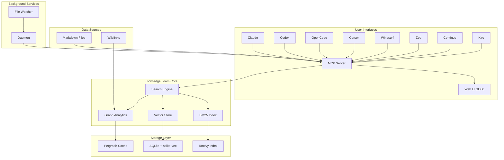
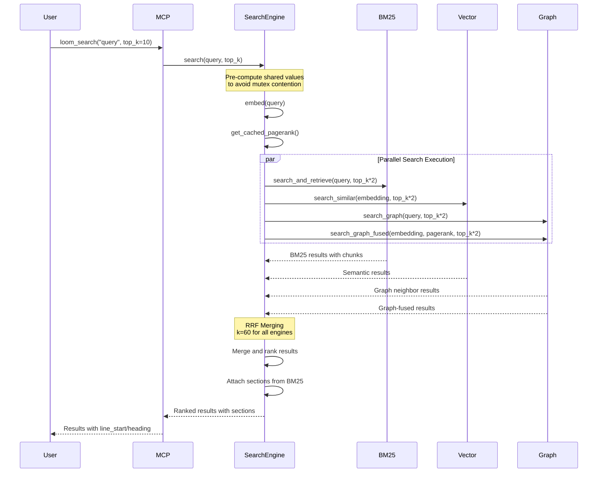
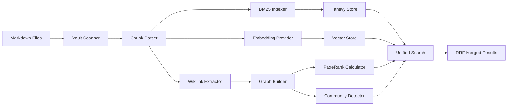
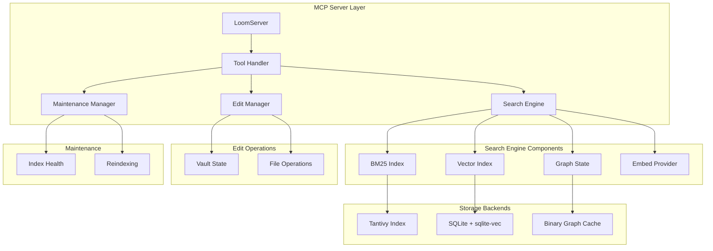

# Knowledge Loom

<p align="center">
  <strong>A unified search and analytics engine for document collections — what code-review-graph is for codebases.</strong>
</p>

<p align="center">
  <a href="https://github.com/odinkirk/knowledge-loom/releases"></a>
  <a href="https://github.com/odinkirk/knowledge-loom/actions/workflows/test.yml"></a>
  <a href="https://www.rust-lang.org/"></a>
  <a href="https://choosealicense.com/licenses/mit/"></a>
  <a href="https://modelcontextprotocol.io/"></a>
</p>

---

## What It Does

The Knowledge Loom indexes your Markdown notes and provides:

- **BM25 full-text search** — Fast keyword search with relevance ranking
- **Semantic vector search** — Embedding-based similarity search (sqlite-vec)
- **Graph analytics** — Wikilink graph with PageRank, communities, and path finding
- **File operations** — Read, edit, and create notes with surgical precision
- **RRF merging** — Unified results from all search engines

All tools are prefixed `loom_` to avoid namespace collisions.

---

## Architecture Overview

### High-Level System Architecture



### Search Flow (RRF Merging)



### Data Processing Pipeline



### Component Interaction



---

## Features

| Category | Feature | Details | Implementation |
|----------|---------|---------|----------------|
| **Search Engines** | BM25 full-text search | Fast keyword search with relevance ranking via Tantivy | `BM25Index::search_and_retrieve()` |
| **Search Engines** | Semantic vector search | Embedding-based similarity search via sqlite-vec | `VectorIndex::search_similar()` |
| **Search Engines** | Graph analytics | Wikilink graph with PageRank, communities, path finding | `GraphState::search_graph()` |
| **Search Engines** | RRF merging | Reciprocal Rank Fusion for unified results (k=60) | `SearchEngine::search()` |
| **Search Engines** | Graph-fused search | Vector similarity boosted by PageRank scores | `SearchEngine::search_graph_fused_inner()` |
| **File Operations** | Surgical editing | Read, edit, create notes with line-level precision | `EditManager` |
| **File Operations** | Heading-based ops | Insert after heading, read section, outline | `EditManager` methods |
| **File Operations** | Vault management | Create, move, delete, link notes | `EditManager` vault operations |
| **File Operations** | Regex search | Pattern-based search across files | `EditManager::grep()` |
| **Graph Analytics** | PageRank ranking | Influence ranking across all notes (damping=0.85, iter=100) | `GraphState::pagerank()` |
| **Graph Analytics** | Community detection | Connected components for thematic clusters | `GraphState::detect_communities()` |
| **Graph Analytics** | Path finding | Shortest path between connected notes (BFS) | `GraphState::dijkstra_path()` |
| **Graph Analytics** | Connection analysis | Find neighbors and relationships | `GraphState::search_graph()` |
| **Graph Analytics** | BFS traversal | Explore graph up to specified depth | `GraphState::bfs_connections()` |
| **Performance** | Parallel execution | All search engines run concurrently via tokio::join! | `SearchEngine::search()` |
| **Performance** | Cached analytics | PageRank and communities cached after computation | `GraphState::cached_pagerank` |
| **Performance** | Incremental updates | Only re-index changed files | `MaintenanceManager` |
| **Performance** | Mutex optimization | Pre-compute shared values to avoid contention | `SearchEngine::search()` |
| **Integration** | MCP protocol | Works with 8+ coding platforms | `LoomServer` |
| **Integration** | Daemon mode | Background watching with auto-reindex | `daemon::run_daemon_foreground()` |
| **Integration** | Web UI | Read-only web interface (port 8080) | `web::run_web()` |
| **Integration** | Shell mode | Interactive shell for testing | `shell::run_shell()` |
| **Storage** | Local-only | No cloud dependencies, all data stays local | All storage backends |
| **Storage** | Efficient indexes | Tantivy, SQLite, binary graph cache | `.knowledge-loom-index/` |
| **Storage** | Chunking strategy | 2000 char chunks with whitespace truncation | `bm25::MAX_CHUNK_CHARS` |
| **Embedding** | Local provider | Built-in embedding support | `LocalEmbedProvider` |
| **Embedding** | Ollama provider | Optional Ollama integration | `OllamaEmbedProvider` |
| **Exclusions** | .loomignore support | Gitignore-style file exclusion | `VaultState` |

---

## Quick Start

### From Source

```bash
# Clone the repository
git clone https://github.com/odinkirk/knowledge-loom.git
cd knowledge-loom

# Build the release binary
cargo build --release

# The binary will be at target/release/loom
```

### Using the Installer (Python version)

Run this from your knowledge directory (the folder containing your Markdown notes):

```bash
curl -fsSL https://raw.githubusercontent.com/odinkirk/knowledge-loom/main/install.sh | bash
```

This creates `.loom/` with the tool files and a Python virtual environment, then merges
the `loom` server into `.mcp.json` (other MCP servers are preserved). It also adds `.loom/`
to `.gitignore` if you're inside a git repo.

To use a different install directory:

```bash
LOOM_DIR=.knowledge-loom curl -fsSL https://raw.githubusercontent.com/odinkirk/knowledge-loom/main/install.sh | bash
```

The installer handles macOS/Linux with managed (PEP 668) or unmanaged Python. It tries
`uv` first, then falls back to `python3 -m venv`, and prints clear guidance if neither works.

### Setting Up for Coding Agents

```bash
# Initialize in current directory (auto-detects all platforms)
loom init

# Initialize in specific directory
loom init /path/to/knowledge

# Initialize for specific platform only
loom init --platform claude
loom init --platform codex
loom init --platform cursor
loom init --platform windsurf
loom init --platform zed
loom init --platform continue
loom init --platform opencode
loom init --platform kiro

# Available platforms: claude, cursor, windsurf, zed, continue, opencode, kiro, codex, all
```

### First Steps

1. Install and configure using one of the methods above
2. Set environment variables if needed
3. Index your notes (automatic on first search)
4. Try your first search
5. Verify installation with `loom_index_status`

---

## Usage Examples

### Finding Related Notes

```bash
# Basic search with RRF merging
loom_search "machine learning" --top-k 10

# Results include line_start and heading for surgical editing
```

### Exploring Connections

```bash
# Find all notes linked from a specific note
loom_find_connections "neural-networks"

# Find shortest path between two notes
loom_find_path_between "ml-basics" "advanced-topics"

# Rank notes by influence (PageRank)
loom_rank_notes
```

### Editing with Precision

```bash
# Read a specific section
loom_read_section "notes.md" "Introduction"

# Insert content after a heading
loom_insert_after_heading "notes.md" "Introduction" "New content here"

# Replace exact line range
loom_replace_lines "notes.md" 10 20 "Updated content"

# Append to file with separator
loom_append_to_file "notes.md" "Additional notes"
```

### Graph Exploration

```bash
# Detect thematic communities
loom_detect_themes

# List all files with metadata
loom_list_files

# Get outline of a file
loom_outline "notes.md"

# Regex search across files
loom_grep "pattern.*test" --file-filter "*.md"
```

---

## Configuration

### Environment Variables

| Variable | Required | Default | Purpose |
|----------|----------|---------|---------|
| `KB_ROOT` | Yes | - | Root path for knowledge base (set by installer) |
| `VAULT_PATH` | Optional | - | Path to document collection — enables graph analytics |

Add optional vars to the `env` block in `.mcp.json` after installation.

### Platform Configuration

**Supported Platforms:**

- **Claude** - `.mcp.json` with `mcpServers` object
- **Codex** - `.codex/config.toml` with TOML format
- **Cursor** - `.cursor/mcp.json` with `.cursorrules` instructions
- **Windsurf** - `~/.codeium/windsurf/mcp_config.json` with `.windsurfrules` instructions
- **Zed** - Platform-specific settings path with `context_servers` object
- **Continue** - `~/.continue/config.json` with array format
- **OpenCode** - `opencode.json` with `mcp` object and `AGENTS.md` instructions
- **Kiro** - `.kiro/settings/mcp.json` with `AGENTS.md` instructions

### Advanced Configuration

- Embedding provider selection (local vs ollama)
- Index tuning parameters
- Daemon configuration
- File exclusion patterns

---

## Architecture Deep Dive

### Component Breakdown

**Vault Scanner (`vault.rs`):**
- File discovery with `.loomignore` support
- Markdown file filtering
- Content reading with error handling

**BM25 Index (`bm25.rs`):**
- Tantivy-based full-text search
- Chunking strategy (2000 char max)
- Heading-aware chunk boundaries
- Relevance ranking with BM25 algorithm

**Vector Store (`index.rs`):**
- sqlite-vec for semantic similarity
- Heading-based chunking
- Cosine distance search
- Embedding upsert and removal

**Graph Engine (`graph.rs`):**
- Petgraph for wikilink analysis
- Wikilink extraction with regex
- Basename resolution for wikilink links
- PageRank computation (damping=0.85, 100 iterations)
- Community detection (connected components)
- Path finding (BFS-based)

**Search Engine (`search.rs`):**
- RRF merging of all search backends
- Parallel execution via tokio::join!
- Mutex optimization with pre-computation
- Result ranking and section attachment
- Graph-fused search with PageRank boosting

**Edit Manager (`edits.rs`):**
- Surgical file operations
- Heading-based navigation
- Line-level precision
- Vault-level management

**Maintenance Manager (`maintenance.rs`):**
- Index health monitoring
- Incremental reindexing
- Cache management

### Search Engine Internals

```rust
// Parallel search execution
let (bm25_results, semantic_results, graph_results, fused_results) = tokio::join!(
    async { /* BM25 search */ },
    async { /* Vector search */ },
    async { /* Graph search */ },
    async { /* Graph-fused search */ }
);

// RRF merging with k=60
let rrf = 1.0 / (60.0 + rank as f32 + 1.0);

// Graph-fused: similarity * (1 + 0.5 * pagerank)
let score = similarity * (1.0 + PAGERANK_WEIGHT * pr_boost);
```

---

## Performance

### Benchmarks

| Metric | Value | Notes |
|--------|-------|-------|
| BM25 search latency | ~10ms | For 10k documents |
| Vector search latency | ~50ms | For 10k documents (sqlite-vec) |
| Graph analytics latency | ~100ms | For 10k nodes (cached) |
| Unified search latency | ~150ms | For 10k documents (parallel) |
| Indexing speed | ~1000 docs/sec | Initial build |
| Incremental reindex | ~50 docs/sec | Changed files only |
| Memory usage | ~200MB | For 10k documents |
| Disk usage | ~500MB | For 10k documents (all indexes) |
| Graph build time | ~2s | For 10k nodes |
| PageRank computation | ~500ms | For 10k nodes (100 iterations) |

*Note: Benchmarks run on MacBook Pro M1, 16GB RAM. Your results may vary.*

### Scalability Characteristics

- Linear scaling for search latency
- Sub-linear for indexing (chunking overhead)
- Memory-efficient storage
- Suitable for vaults up to 100k documents

---

## Tool Reference

### Search Tools

- `loom_search` - RRF-merged BM25 + semantic search
- `loom_search_file` - Search within specific file
- `loom_search_graph` - Graph connections for a note

### Graph Analytics Tools

- `loom_rank_notes` - PageRank influence ranking
- `loom_find_connections` - Links and relationships
- `loom_find_path_between` - Shortest graph path
- `loom_detect_themes` - Louvain community detection

### Navigation Tools

- `loom_list_files` - All Markdown files
- `loom_outline` - Heading hierarchy
- `loom_grep` - Regex search

### Read Tools

- `loom_read_section` - Content under heading
- `loom_read_lines` - Exact line range

### Edit Tools

- `loom_replace_lines` - In-place replacement
- `loom_insert_after_heading` - Insert under heading
- `loom_append_to_file` - Append with separator
- `loom_create_note` - Create new note
- `loom_edit_note` - Replace full content
- `loom_link_notes` - Add wikilink
- `loom_move_note` - Move note
- `loom_delete_note` - Delete note
- `loom_apply_edit_preview` - Dry-run preview

### Maintenance Tools

- `loom_reindex` - Rebuild all indexes
- `loom_index_status` - Health and chunk counts

---

## CLI Commands

```bash
loom init [--platform <name>] [dir]  # Initialize for coding agents
loom serve                          # Start MCP stdio server
loom shell                          # Interactive shell
loom daemon start                   # Start background daemon
loom daemon stop                    # Stop daemon
loom daemon status                 # Check daemon status
loom daemon logs                   # View daemon logs
loom daemon add <path>             # Add repo to daemon
loom daemon remove <id>            # Remove repo from daemon
loom reindex                        # Reindex knowledge base
loom web [--port]                   # Start web UI (default port 8080)

# Platform options for init: claude, cursor, windsurf, zed, continue, opencode, kiro, codex, all
```

---

## Excluding Files

Create a `.loomignore` file in your knowledge directory. It supports the same patterns
as `.gitignore`: directory patterns (`.venv/`), file globs (`*.dist-info/`), and exact names.

---

## Troubleshooting

### Common Issues

*This section is a placeholder for common issues and their solutions. As issues are discovered and documented, they will be added here.*

### Platform-Specific Issues

- **macOS**: Python environment setup
- **Linux**: System dependencies
- **Windows**: Path handling

---

## Comparison with Alternatives

| Feature | Knowledge Loom | obsidian-brain | code-review-graph | brainjar | Smart Connections |
|---------|----------------|----------------|-------------------|----------|-------------------|
| Primary focus | Document collections | Obsidian vaults | Codebases | Document collections | Obsidian vaults |
| Search engines | 3 (BM25, vector, graph) | 2 (vector, graph) | 1 (graph) | 2 (vector, graph) | 1 (vector) |
| BM25 support | ✅ | ❌ | ❌ | ❌ | ❌ |
| Graph analytics | ✅ | ✅ | ✅ | ✅ | ❌ |
| RRF merging | ✅ | ❌ | ❌ | ❌ | ❌ |
| **Surgical editing** | ✅ | ❌ | ✅ | ❌ | ❌ |
| MCP support | ✅ | ✅ | ✅ | ✅ | ❌ |
| Local-only | ✅ | ✅ | ✅ | ✅ | ✅ |
| Daemon mode | ✅ | ❌ | ✅ | ❌ | ❌ |
| Web UI | ✅ | ❌ | ❌ | ❌ | ❌ |
| Language | Rust | TypeScript | Python | Rust | JavaScript |
| Storage | Tantivy + SQLite + Binary | External Rust brain | SQLite | SQLite + Binary | JSON in vault |

---

## Development & Testing

### Prerequisites

- Rust 1.70 or later
- Cargo (comes with Rust)

### Build

```bash
# Debug build (faster compilation)
cargo build

# Release build (optimized)
cargo build --release
```

### Test Corpus

The automated tests run against `test-vault/`. [ashuotaku/Personal-Wiki](https://github.com/ashuotaku/Personal-Wiki) makes a good corpus for it:

```bash
git clone https://github.com/ashuotaku/Personal-Wiki test-vault
```

### Automated Tests

```bash
# Run all tests
cargo test

# Run tests with output
cargo test -- --nocapture

# Run specific test
cargo test test_file::test_function

# Run tests in release mode (faster)
cargo test --release
```

### Smoke Test (CLI)

Run these from the repo root using `test-vault/` as the corpus:

```bash
# Build the binary first
cargo build --release

# Index health
KB_ROOT=test-vault ./target/release/loom index-status

# Quick search
KB_ROOT=test-vault ./target/release/loom search "knowledge" --top-k 5

# List files
KB_ROOT=test-vault ./target/release/loom list-files

# Get outline of a file
KB_ROOT=test-vault ./target/release/loom outline test-vault/SomeNote.md

# Grep for a pattern
KB_ROOT=test-vault ./target/release/loom grep "pattern" --file-filter "*.md"

# Reindex
KB_ROOT=test-vault ./target/release/loom reindex
```

### Smoke Test (After Installation)

Run these from your knowledge directory (where `.loom/` was created):

```bash
# Index health — shows chunk count and KB root
KB_ROOT=. .loom/.venv/bin/python3 -c \
  'import sys; sys.path.insert(0,".loom"); import asyncio,loom_mcp; print(asyncio.run(loom_mcp.loom_index_status()))'

# Quick search — should return results from your notes
KB_ROOT=. .loom/.venv/bin/python3 -c \
  'import sys; sys.path.insert(0,".loom"); import asyncio,loom_mcp; r=asyncio.run(loom_mcp.loom_search("knowledge")); print(len(r["results"]),"results via",r["engines"])'
```

Then restart Claude Code and run `/mcp` — `loom` should appear in the connected server list.

---

## Contributing

Contributions are welcome! Please read our contributing guidelines and submit pull requests to the main branch.

### Guidelines

- Follow existing code style and conventions
- Add tests for new features
- Update documentation as needed
- Ensure all tests pass before submitting

---

## License

This project is dual-licensed under either:

- **MIT License** - [LICENSE-MIT](LICENSE-MIT) or https://opensource.org/licenses/MIT
- **Apache License, Version 2.0** - [LICENSE-APACHE](LICENSE-APACHE) or https://www.apache.org/licenses/LICENSE-2.0

You may choose either license for your use.

### Third-Party Licenses

All dependencies use permissive, commercial-friendly licenses. See `about.toml` for the full list.

---

## Credits

Built with:
- [Tantivy](https://github.com/quickwit-oss/tantivy) - Full-text search engine
- [sqlite-vec](https://github.com/asg017/sqlite-vec) - Vector similarity search
- [petgraph](https://github.com/petgraph/petgraph) - Graph algorithms

Inspired by:
- [obsidian-brain](https://github.com/ruvnet/obsidian-brain) - Obsidian plugin with semantic search
- [code-review-graph](https://github.com/tirth8205/code-review-graph) - Code graph analysis
- [brainjar](https://github.com/yourusername/brainjar) - Document collection search

---

## Support

For issues, questions, or contributions, please visit [GitHub Issues](https://github.com/odinkirk/knowledge-loom/issues).
